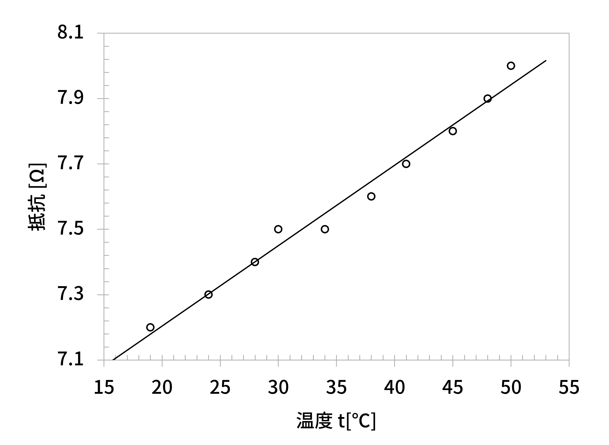

# サンプルのドキュメント

<div class="author">

- クラス：A
- 学籍番号：123ABC
- 氏名：苗字名前

</div>

## いろいろと試す

### Syntax Highlight

内部でPrism.jsを使用しているため、様々な言語が使用可能。色のカスタマイズも簡単である。

```html title=testあああ.html
<div class="theorem">
  <div class="theorem-heading"></div>

  数列 $\{a_k\}$ について考える。
</div>
```

````title=コードブロック
```html title=testあああ.html
<div class="theorem">
  <div class="theorem-heading"></div>

  数列 $\{a_k\}$ について考える。
</div>
```

````

インラインのコードは `こんな感じ、aiueo`になる

### 数式

Vivliostyleは、$\mathrm{\LaTeX}$ で使用される数式を使うことができる。

#### インライン数式

このように、本文中に $y=ax+b$ のように書くことで、数式を表示できる。

`このように、本文中に $y=ax+b$ のように書くことで、数式を表示できる。`

#### 別行立て数式

`$$~$$`で挟まれた部分に数式を書くことができる。自動で数式番号が付与される。`h2`レベルの見出しごとに、カウンタがリセットされる。
数式番号の参照はまだ実現できていない。

https://gihyo.jp/article/2025/02/vivliostyle-05-2#ghd7AWAtwX にある方法を用いると、数式の前後にタグを入れなければならず、面倒である。

番号をなくしたい場合は、[[番号無し数式]](#番号無し数式) の項を見てください

```tex title=texのサンプル
$$\sum_{k=m}^{n} a_k = a_m + a_{m+1} + \cdots + a_n$$
$$(a+b)^n = \sum_{k=0}^n \binom{n}{k} a^{n-k} b^k$$
$$\mathbf{a} \cdot \mathbf{b} = |\mathbf{a}| |\mathbf{b}| \cos\theta$$
$C$を積分定数として
$$\int x^n dx = \frac{1}{n+1} x^{n+1} + C \quad (n \neq -1)$$
```

$$\sum_{k=m}^{n} a_k = a_m + a_{m+1} + \cdots + a_n$$
$$(a+b)^n = \sum_{k=0}^n \binom{n}{k} a^{n-k} b^k$$
$$\mathbf{a} \cdot \mathbf{b} = |\mathbf{a}| |\mathbf{b}| \cos\theta$$
$C$を積分定数として
$$\int x^n dx = \frac{1}{n+1} x^{n+1} + C \quad (n \neq -1)$$


### 表のサンプル

`<figure>`要素のどこに`<figcaption>`要素があるのかを用いて、表と図を区別する。次のサイトを参照すること。

- https://gihyo.jp/article/2025/02/vivliostyle-05-2#gh2Xq8vaNb
- https://gihyo.jp/article/2025/02/vivliostyle-05#ghfbEpozht

MarkdownのなかにHTMLを使用する際、空行が必要なことに注意する。

```md title=表のサンプル
<figure class="table">
<figcaption>銅線の抵抗値の温度変化</figcaption>

|   温度 $t$(℃)    | 19.0 | 24  | 28  | 30  | 19.0 | 24  | 28  | 30  |
| :--------------: | ---- | --- | --- | --- | ---- | --- | --- | --- |
| 抵抗 $R_{ab}$(Ω) | 7.3  | 7.4 | 7.5 | 7.6 | 7.3  | 7.4 | 7.5 | 7.6 |
|   抵抗 $R$(Ω)    | 7.2  | 7.3 | 7.4 | 7.5 | 7.2  | 7.3 | 7.4 | 7.5 |

</figure>
```

<figure class="table">
<figcaption>銅線の抵抗値の温度変化</figcaption>

|   温度 $t$(℃)    | 19.0 | 24  | 28  | 30  | 19.0 | 24  | 28  | 30  |
| :--------------: | ---- | --- | --- | --- | ---- | --- | --- | --- |
| 抵抗 $R_{ab}$(Ω) | 7.3  | 7.4 | 7.5 | 7.6 | 7.3  | 7.4 | 7.5 | 7.6 |
|   抵抗 $R$(Ω)    | 7.2  | 7.3 | 7.4 | 7.5 | 7.2  | 7.3 | 7.4 | 7.5 |

</figure>

### 図のサンプル

次のような記法を使用します。

```md
{.fig #fig-Cu width=500}
```

（上のように、タイトルなしのコードブロックも可能）

{.fig #fig-Cu width=500}

- `.fig`
  - 図のためのクラス
  - おそらく、`theme-academic`で定義されていたはず
- `#fig-Cu`
  - 図のid
  - 一意にする必要がある
  - 別の場所から図のidを用いて参照できる
    - 例
      - `「[](#fig-Cu){.fig-ref}」のように使用する`
      - 「[](#fig-Cu){.fig-ref}」のように使用する
    - `.fig-ref`は、このリポジトリで定義したCSSクラス
      - 図に振られた番号は、idをもとに指定したaタグを介して取得されているらしい
      - 図の番号は自動で挿入される

### 数式の続き

#### 番号付き数式の続き

h3の見出しが変わっても、数式番号はそのままになっている。

$$
x = \frac{-b \pm \sqrt{b^2-4ac}}{2a}
$$

$$
e^{i\pi} + 1 = 0
$$

$$df = \frac{\partial f}{\partial x} dx + \frac{\partial f}{\partial y} dy + \frac{\partial f}{\partial z} dz$$

#### 番号無し数式

`<div class="no-eqation-counter"></div>` で囲うことで、その中にある数式には数式番号を表示させないようにできる。このとき、数式番号は増加しない。

<div class="no-eqation-counter">

$$
\frac{\pi}{4} = \sum_{n=0}^\infty \frac{(-1)^n}{2n+1}
$$

</div>

次の数式は、`<div class="no-eqation-counter"></div>` で囲んでいないので、番号が表示される。

$$
\int_{-\infty}^{\infty} e^{-x^2} dx = \sqrt{\pi}
$$

次の数式は、番号が表示される。

$$(AB)_{ij} = \sum_k A_{ik} B_{kj}$$

## 段落２

章をまたぐと、数式や「例」の番号がリセットされる。

### 枠

<div class="theorem">
<div class="theorem-heading"></div>

数列 $\{a_k\}$ について考える。

</div>

<div class="theorem">
<div class="theorem-heading">吾輩は猫である</div>
吾輩は猫である。名前はまだ無い。どこで生まれたか頓（とんと）見当がつかぬ。何でも薄暗いじめじめした所でニャーニャー泣いていた事だけは記憶している。吾輩はここで始めて人間というものを見た。
</div>

<div class="theorem">
<div class="theorem-heading">人間失格</div>
恥の多い生涯を送って来ました。自分には、人間の生活というものが、見当つかないのです。私は、東北の田舎に生れましたので、汽車をはじめて見たのは、よほど大きくなってからでした。
</div>

ちゃんと番号がインクリメントされている。

### 枠の続き

<div class="theorem">

<!-- <div class="theorem-heading"></div> -->

カムパネルラ、また僕たち二人きりになったねえ、どこまでもどこまでも一緒に行こう。僕はもうあのさそりのように、みんなの{幸|さいわい}のためならば、僕のからだなんか百ぺん{灼|や}いてもかまわないんだ。

</div>

Viliviostyleでは、`{幸|さいわい}`のようにしてルビを振ることができます。

この枠には見出しがありません。`<div class="theorem-heading"></div>`を書かなければ見出しは出力されません。ただし、番号はインクリメントされてしまいます。今後修正します。

<div class="theorem">
<div class="theorem-heading">舞姫</div>

石炭をば早や積み果てつ。中等室の卓のほとりはいと靜にて、{熾熱燈|しねつとう}の光の晴れがましきも徒なり。今宵は夜毎にこゝに集ひ來る{骨牌|かるた}仲間も「ホテル」に宿りて、舟に殘れるは余一人のみなれば。

</div>

<div class="theorem">
<div class="theorem-heading">見出し</div>

マクスウェル方程式のうち、ファラデーの電磁誘導の法則（微分形）について考えてみよう。

$$
\nabla \times \mathbf{E} = -\frac{\partial \mathbf{B}}{\partial t}
$$

もちろん、枠の中に数式を入れることだってできる。

$$\sqrt{n}\left(\frac{\bar{X}_n - \mu}{\sigma}\right) \xrightarrow{d} N(0,1)$$

```tex
<div class="theorem">
<div class="theorem-heading">見出し</div>

マクスウェル方程式のうち、ファラデーの電磁誘導の法則（微分形）について考えてみよう。

$$ \nabla
\times \mathbf{E} = -\frac{\partial \mathbf{B}}{\partial t}
$$

もちろん、枠の中に数式を入れることだってできる。
$$

\sqrt{n}\left(\frac{\bar{X}_n -
\mu}{\sigma}\right) \xrightarrow{d} N(0,1)

$$
</div>
```

</div>
